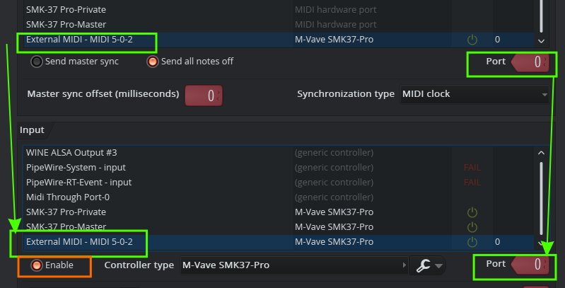

# Important
You have to import provided preset into controller to be able to use provided scripts. Please use MidiSuite to import **mapped_preset_fl.smk37** into any chosen slot in controller. You have to use this preset in controller.

# Installation
Place **M-Vave** folder in

> ` Documents\Image-Line\FL Studio\Settings\Hardware\`

# Setup

There should be 3 controllers:
* Master
* Private
* External

Script tries to automatically match devices by names (but it may fail). Message me if you find other suitable names exposed by this controller.
Define binding between Output and Input *External* controller (it's required to control board leds), select on both port = 0
Do not forget to enable All 3 controllers

# Implemented features
* Play
* Stop
* Record
* Rewind
* Fast forward
* Undo

* Faders control volume on corresponding channels
* With shift change SEND amount

Pad 24 is reserved for "SHIFT", but due to lack of knowlege currently it's not possible to use SHIFT with pads (it's sent via different inputs and handled separately). With rebinding LED output doesn't work, so for now it's semi broken.

# Future
I'm not using FL regularly. If you have some ideas, file Feature request on GitHub. For some inspiration you could use https://www.image-line.com/fl-studio-learning/fl-studio-online-manual/html/midi_scripting.htm

# Other options

There are some general purpose FL controller frameworks:

* https://github.com/MaddyGuthridge/Universal-Controller-Script
* https://github.com/forgery810/fl-studio-all-devices

