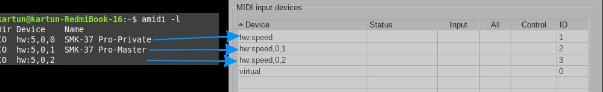
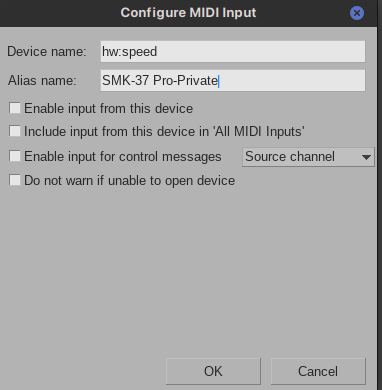
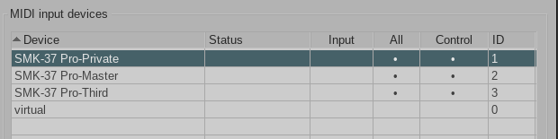
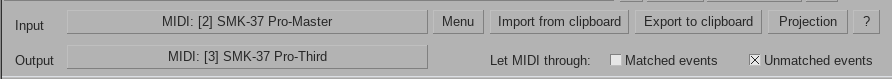
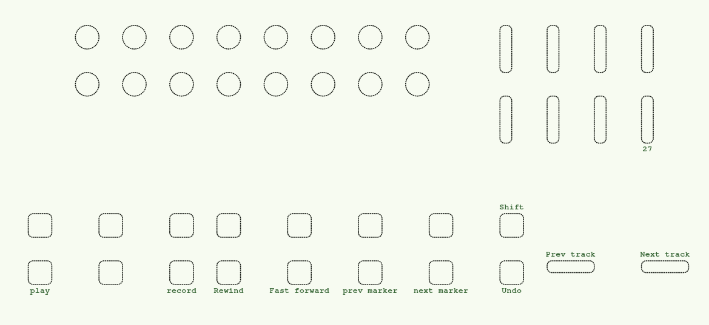
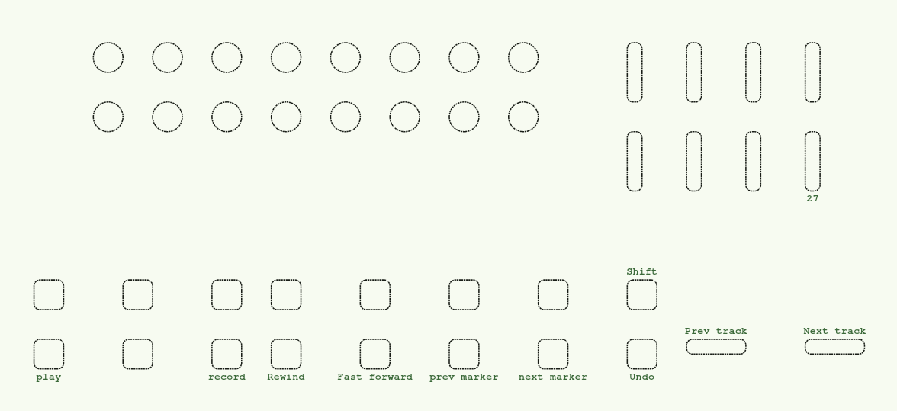

# Installation

This repository contains a custom **ReaScript MIDI Controller Script** for REAPER.  
Follow the instructions below to install it on your system.  

---
## 0. Prerequisite
This script built ontop of ReaLean/Helgobox. Tested with v.2.18.1.
It's recommended to have actual version of Helgobox 

## 1. ReaPack - recommended
Add repository to ReaPack and install package

## 2. Manual (not recommended)
Copy complete folder (mvave) recreating folder structure into

Linux - ~/.config/REAPER/Data/helgoboss/realearn/presets/main

## Aliasing
### Linux  
In Linux REAPER use hardware names, script use human friendly names.
Example:

`amidi -l
Dir Device    Name
IO  hw:5,0,0  SMK-37 Pro-Private
IO  hw:5,0,1  SMK-37 Pro-Master
IO  hw:5,0,2`  
---

Find readable names

Define aliases for every port (script use aliases)

For unnamed port define "SMK-37 Pro-Third"

Final result should be like this:

Do the same for MIDI output devices, and enable output to it.
** TODO ** check which one should be defined as output

## First run
Add at least one track and insert (or, if you are brave an FX in master) an instance of Helgobox.
For more details, please refer to Helgobox documentation.

### Open Helgobox
Setup routes

In controller presets find required one (User(mvave)->Unsorted->SMK37 Pro)

### Tune up (optional)
In main compartment perform required adjustment to your taste.

### Default mappings

